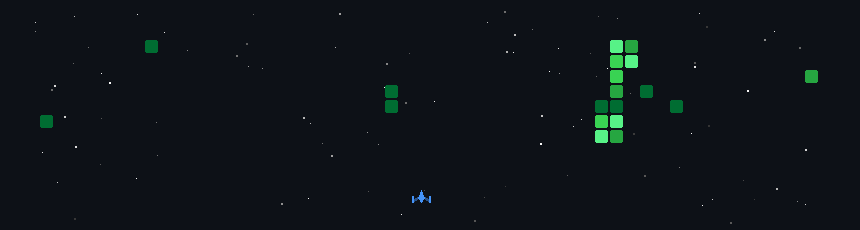

 

<h1>Hey there, I'm <i>Pranav</i>! 👋</h1>

  COMPUTER SCIENCE &nbsp;·&nbsp; DATA SCIENCE &nbsp;·&nbsp; BUILDING THINGS

  
  
  
  

 

01

<h2>ABOUT</h2>

<blockquote>
A CS student obsessed with Data Science. I thrive on solving puzzles that make your brain work overtime and cranking out code that actually works (most of the time). Off the keyboard, I'm usually skateboarding like a pro (or trying not to faceplant) and breaking things apart just to see if I can put them back together better.
</blockquote>

 

02

<h2>LANGUAGES</h2>

  
  
  
  
  

  
  
  

 

03

<h2>TOOLS &amp; FRAMEWORKS</h2>

  
  
  
  
  
  
  

  
  
  
  
  
  

  

04

<h2>CONTRIBUTION ARCADE</h2>

  

